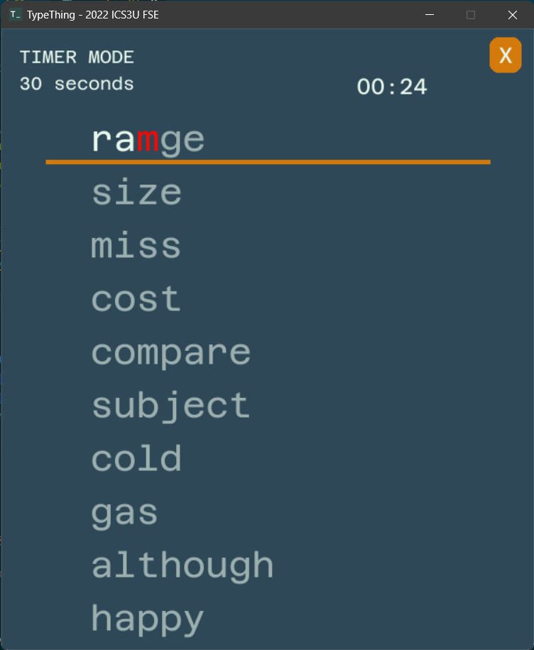
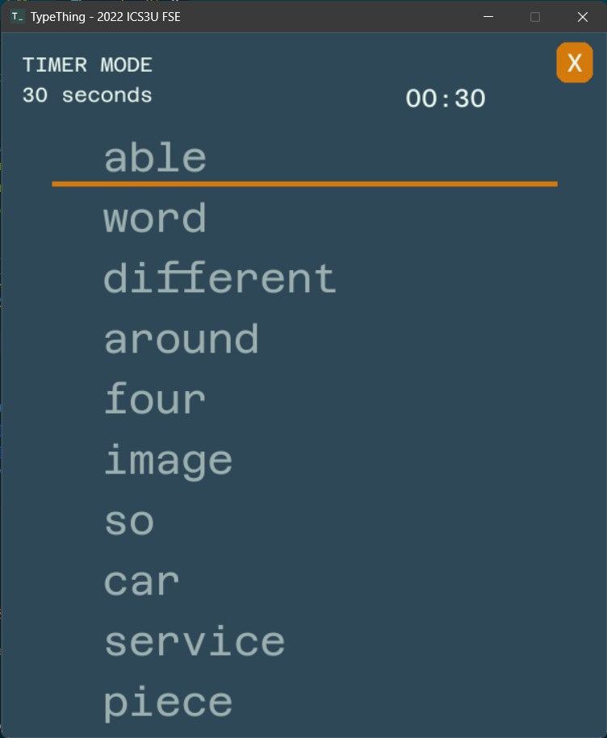
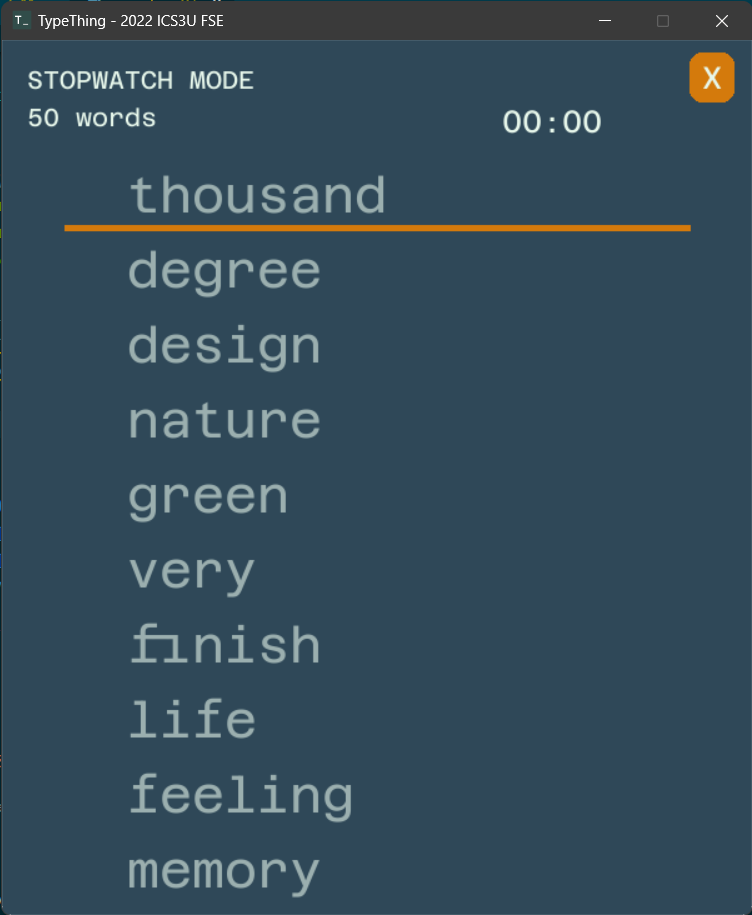

# TypeThing

[About](#about) ◈ [Features](#features) ◈ [Installation](#installation) ◈ [How to use](#how-to-use) ◈ [How is typing speed calculated?](#how-is-typing-speed-calculated)

## About

> [!NOTE]  
> This project was made for a school assignment. It is no longer maintained.

TypeThing is a typing speed test with 2 modes. It runs locally so you can practice your keyboard skills even when offline.

## Installation

### Windows

1. Create a virtual environment

    `python -m venv <name of environment>`

2. Download source code as a .zip
3. Unzip it into the folder with virtual environment
4. Install required packages from *requirements.txt*

    `pip install -r requirements.txt`

## How to use

1. Run *main2.py*
2. Select the game mode you want to play
3. Type! The timer starts with your first key press. Errors will be indicated in red. Press the space bar to move onto the next word; once you move on, previous mistakes can't be erased
4. Choose to redo the last game, play a new game, or select a different mode

## Features

- **Timer Mode:** Type as many words as you can in 30 or 60 seconds
  
- **Stopwatch Mode:** Type 25, 50, or 75 words as fast as possible
  
- Stores high score
- Replay the game you just finished (with the same words)

## How is typing speed calculated?

tba